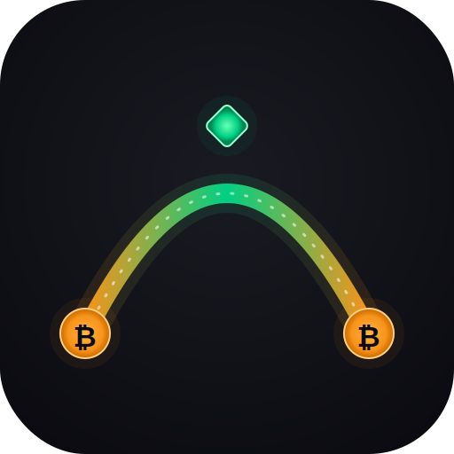

<p align="center">
  
</p>

# Catapult on StartOS

> **Upstream repo:** `~/coinswap-research/catapult/` (local)

Catapult is a client-side, non-custodial CoinSwap web app that composes two chain swaps — Middle Way (BTC→L-BTC) and Boltz (L-BTC→BTC) — via a catapult pattern to break the on-chain graph between your source and destination Bitcoin wallets. Self-to-self only.

This StartOS package ships the compiled static build as a minimal nginx container. No backend, no state, no dependencies. All API calls (Middle Way, Boltz, mempool.space) happen from your browser.

## Architectures

`x86_64`, `aarch64`.

## Build

```sh
# 1. Sync dist/ from the upstream catapult source
./scripts/sync-dist.sh

# 2. Pack + sideload (requires start-cli + host in ~/.startos/config.yaml)
make clean x86 install     # x86_64 (Umbrel Home, Intel servers)
# or
make clean arm install     # aarch64 (RPi, ARM servers)
```

## Runtime notes

- Container: `nginx:alpine` serving `/usr/share/nginx/html` on port 80.
- SPA fallback: `try_files $uri $uri/ /index.html` (catapult uses `HashRouter`, so no deep-link breakage either way).
- Access logs off by default — the onion client always looks like `127.0.0.1` anyway, so logs add no value.
- No persistent volume. Swap state (refund mnemonics, swap IDs) lives in the browser's `localStorage`. That means: **clearing browser data while a swap is in progress loses the ability to recover unless you downloaded the refund files**.
- No dependencies. Catapult does not talk to any service on your node.

## Privacy model

- StartOS automatically exposes both a `.onion` (Tor hidden service) and a `.local` LAN address.
- Recommended access: the `.onion` via Tor Browser. That way the API calls to `api.boltz.exchange` / `api.middle-way.space` / `mempool.space` stay inside Tor (the browser picks the onion endpoints when the page origin is `.onion`).
- If you access via LAN, catapult will reach out to the clearnet APIs of the backends and your IP will be visible to them (but not your wallet graph — that's the point of the cross-chain routing).

## License

AGPL-3.0.
